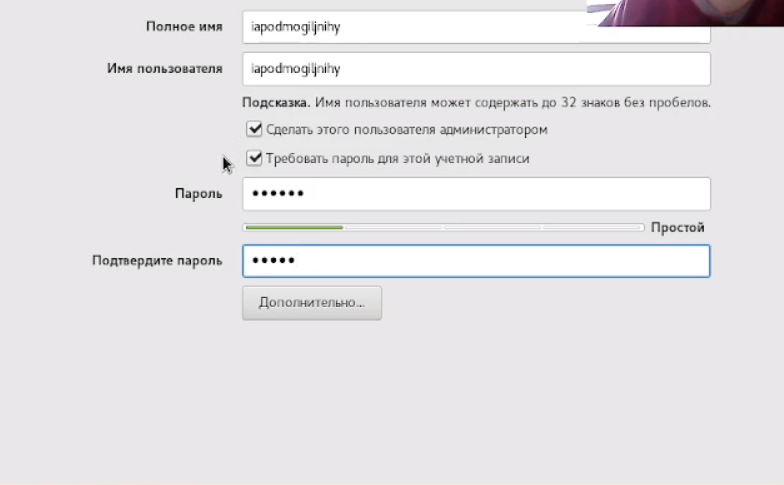
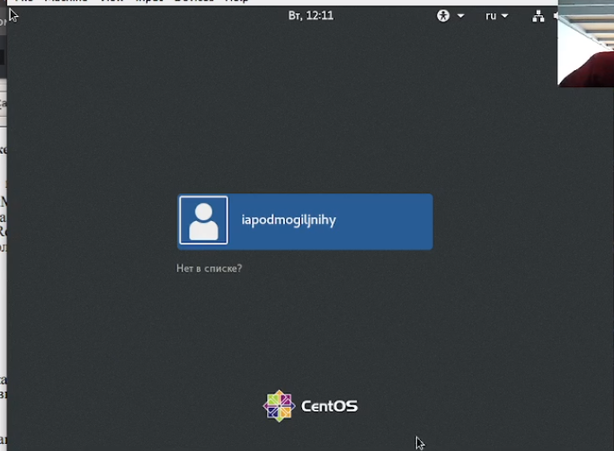

---
## Front matter
lang: ru-RU
title: Лабораторная работа №1
author: |
	Подмогильный Иван Александрович - студент группы НКНбд-01-18
date: 15.09.2021

## Formatting
toc: false
slide_level: 2
theme: metropolis
header-includes:
 -  \metroset{progressbar=frametitle,sectionpage=progressbar,numbering=fraction}
 - '\makeatletter'
 - '\beamer@ignorenonframefalse'
 - '\makeatother'
aspectratio: 43
section-titles: true
---

# Установка виртуальной машины CentOS и её конфигурация.

## Прагматика выполнения

- Умение устанавливать и конфигурировать виртуальные машины с использованием VirtualBox

## Цель выполнения лабораторной работы

- Установка виртуальной машины CentOS
- Конфигурация установленной машины

## Задачи выполнения работы

- Установить VirtualBox и установить на него CentOS
- Сделать конфигурацию установленной машины
- Установить минимальный необходимый пакет ПО.
- Создать еще одну машину Host2 на базе уже сконфигурированной виртуальной машины Base

## Результаты выполнения лабораторной работы

- Установил виртуальную машину и установил имя $\textbf{iapodmogiljnihy}$
{ #fig:008 width=70% }
- Установил тип созданной машины Base на Multi-Attach и создал новую виртуальную машину под названием Host2, на основе машины Base.
{ #fig:013 width=70% }

## Выводы

Приобрёл практические навыки установки операционной системы на виртуальную машину, настройки минимально необходимых для
дальнейшей работы сервисов.
