---
# Front matter
lang: ru-RU
title: "Информационная безопасность"
subtitle: "Лабораторная работа 1"
author: "Подмогильный Иван Александрович"

# Formatting
toc-title: "Содержание"
toc: true # Table of contents
toc_depth: 2
lof: true # List of figures
lot: true # List of tables
fontsize: 12pt
linestretch: 1.5
papersize: a4paper
documentclass: scrreprt
polyglossia-lang: russian
polyglossia-otherlangs: english
mainfont: PT Serif
romanfont: PT Serif
sansfont: PT Sans
monofont: PT Mono
mainfontoptions: Ligatures=TeX
romanfontoptions: Ligatures=TeX
sansfontoptions: Ligatures=TeX,Scale=MatchLowercase
monofontoptions: Scale=MatchLowercase
indent: true
pdf-engine: lualatex
header-includes:
  - \linepenalty=10 # the penalty added to the badness of each line within a paragraph (no associated penalty node) Increasing the value makes tex try to have fewer lines in the paragraph.
  - \interlinepenalty=0 # value of the penalty (node) added after each line of a paragraph.
  - \hyphenpenalty=50 # the penalty for line breaking at an automatically inserted hyphen
  - \exhyphenpenalty=50 # the penalty for line breaking at an explicit hyphen
  - \binoppenalty=700 # the penalty for breaking a line at a binary operator
  - \relpenalty=500 # the penalty for breaking a line at a relation
  - \clubpenalty=150 # extra penalty for breaking after first line of a paragraph
  - \widowpenalty=150 # extra penalty for breaking before last line of a paragraph
  - \displaywidowpenalty=50 # extra penalty for breaking before last line before a display math
  - \brokenpenalty=100 # extra penalty for page breaking after a hyphenated line
  - \predisplaypenalty=10000 # penalty for breaking before a display
  - \postdisplaypenalty=0 # penalty for breaking after a display
  - \floatingpenalty = 20000 # penalty for splitting an insertion (can only be split footnote in standard LaTeX)
  - \raggedbottom # or \flushbottom
  - \usepackage{float} # keep figures where there are in the text
  - \floatplacement{figure}{H} # keep figures where there are in the text
---

# Цель работы

Приобретение практических навыков установки операционной системы на виртуальную машину, настройки минимально необходимых для
дальнейшей работы сервисов.

# Задание

- Установить CentOS на виртульную машину
- Сконфигурировать его и установить минимальный необходимый пакет библиотек.

# Выполнение лабораторной работы

## Установка виртуальной машины.
1. Создал каталог в папке $\textbf{/var/tmp}$ под названием $\textbf{iapodmogiljnihy}$.
2. Установил каталог по умолчанию для виртуальных машин $\textbf{/var/tmp/iapodmogiljnihy}$  (рис. \ref{fig1})
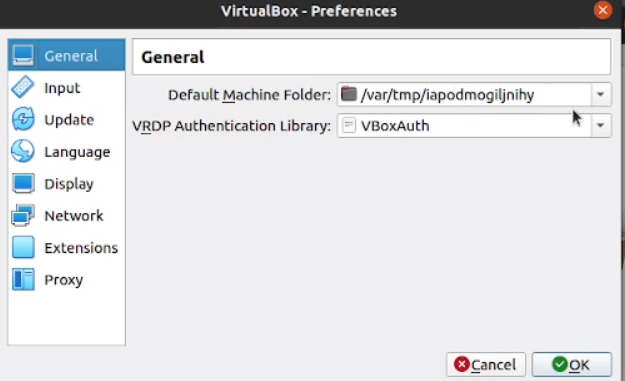{ #fig:001 width=70% }
3. Создал виртуальную машину под названием Base версии Red Had (64 bit)
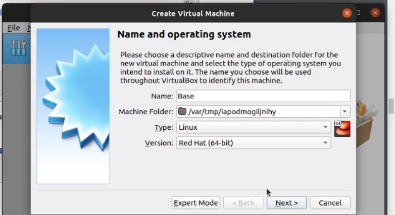{ #fig:002 width=70% }
4. Выбрал опцию виртуального жёсткого диска
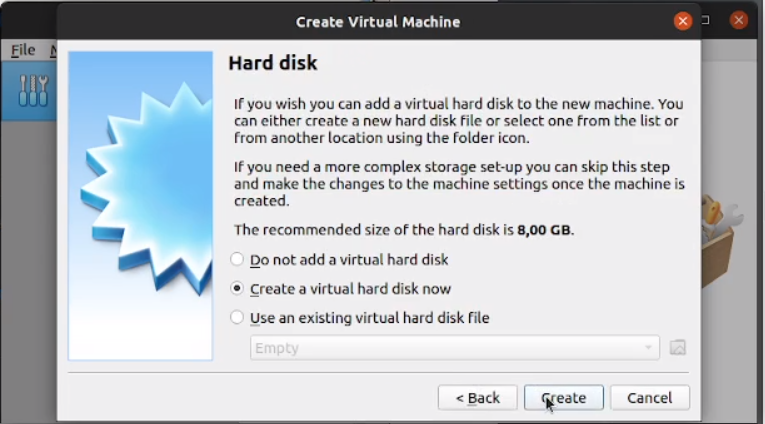{ #fig:003 width=70% }
5. Выбрал опцию VDI
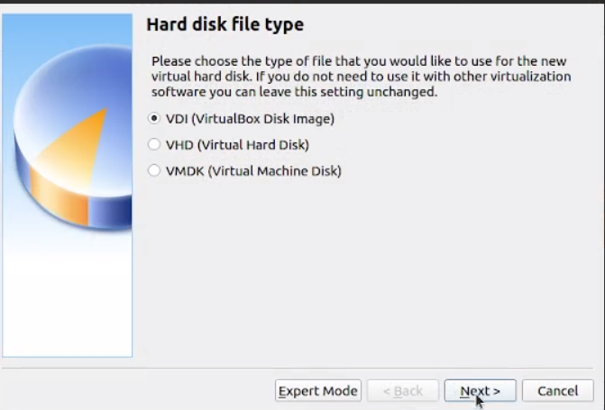{ #fig:004 width=70% }
6. Выбрал опцию динамичесского выделения памяти
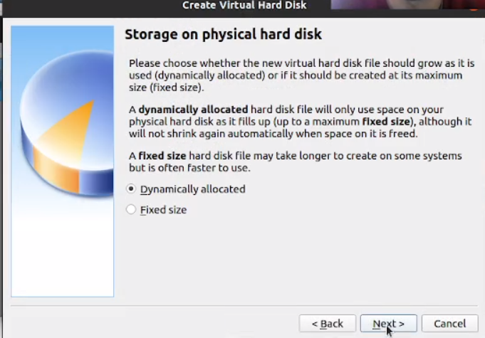{ #fig:005 width=70% }
7. Установил объем диска 40GB
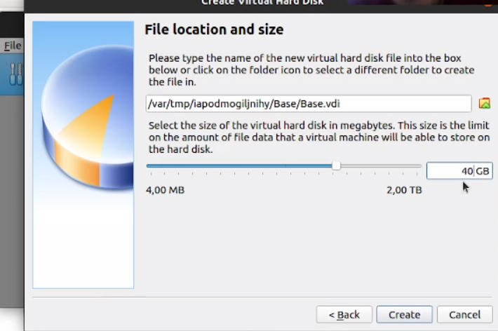{ #fig:006 width=70% }
8. Выбрал заранее скачанный оптический диск CentOS
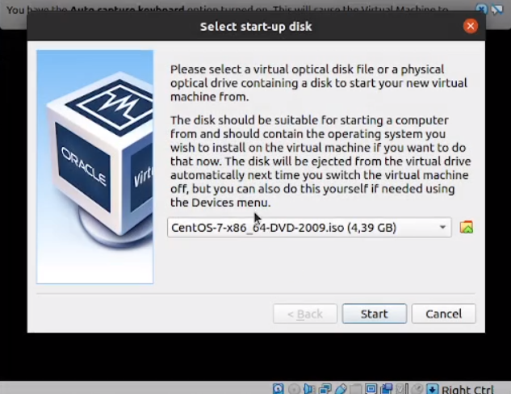{ #fig:007 width=70% }
9. Установил имя iapodmogiljnihy в виртуальной машине
{ #fig:008 width=70% }
10. Выбрал устройство установки виртуальной машины и перешел к установке
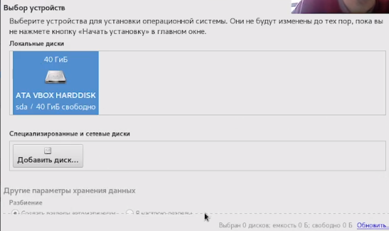{ #fig:009 width=70% }
11. После установки виртуальной машины перешёл к установке этой машины для множественного использования
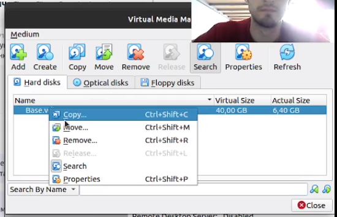{ #fig:010 width=70% }
12. Установил тип машины Multi-Attach
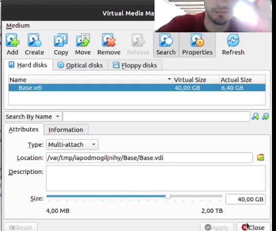{ #fig:011 width=70% }
13. Создал новую виртуальную машину под названием Host2, повторил ранее описанную процедуру
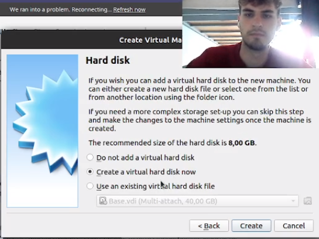{ #fig:012 width=70% }
14. Как видно на рисунке, запустилась ранее сконфигурированная виртуальная машина.
{ #fig:013 width=70% }

# Выводы

Приобрёл практические навыки установки операционной системы на виртуальную машину, настройки минимально необходимых для
дальнейшей работы сервисов.
