---
# Front matter
title: "Информационная безопасность."
subtitle: "Лабораторная работа №1."
author: "Подмогильный Иван Александрович."

# Generic otions
lang: ru-RU
toc-title: "Содержание"

# Bibliography

# Pdf output format
toc: true # Table of contents
toc_depth: 2
lof: true # List of figures
lot: true # List of tables
fontsize: 12pt
linestretch: 1.5
papersize: a4
documentclass: scrreprt
## I18n
polyglossia-lang:
  name: russian
  options:
  - spelling=modern
  - babelshorthands=true
polyglossia-otherlangs:
  name: english
### Fonts
mainfont: PT Serif
romanfont: PT Serif
sansfont: PT Sans
monofont: PT Mono
mainfontoptions: Ligatures=TeX
romanfontoptions: Ligatures=TeX
sansfontoptions: Ligatures=TeX,Scale=MatchLowercase
monofontoptions: Scale=MatchLowercase,Scale=0.9
## Biblatex
biblatex: true
biblio-style: "gost-numeric"
biblatexoptions:
  - parentracker=true
  - backend=biber
  - hyperref=auto
  - language=auto
  - autolang=other*
  - citestyle=gost-numeric
## Misc options
indent: true
header-includes:
  - \linepenalty=10 # the penalty added to the badness of each line within a paragraph (no associated penalty node) Increasing the value makes tex try to have fewer lines in the paragraph.
  - \interlinepenalty=0 # value of the penalty (node) added after each line of a paragraph.
  - \hyphenpenalty=50 # the penalty for line breaking at an automatically inserted hyphen
  - \exhyphenpenalty=50 # the penalty for line breaking at an explicit hyphen
  - \binoppenalty=700 # the penalty for breaking a line at a binary operator
  - \relpenalty=500 # the penalty for breaking a line at a relation
  - \clubpenalty=150 # extra penalty for breaking after first line of a paragraph
  - \widowpenalty=150 # extra penalty for breaking before last line of a paragraph
  - \displaywidowpenalty=50 # extra penalty for breaking before last line before a display math
  - \brokenpenalty=100 # extra penalty for page breaking after a hyphenated line
  - \predisplaypenalty=10000 # penalty for breaking before a display
  - \postdisplaypenalty=0 # penalty for breaking after a display
  - \floatingpenalty = 20000 # penalty for splitting an insertion (can only be split footnote in standard LaTeX)
  - \raggedbottom # or \flushbottom
  - \usepackage{float} # keep figures where there are in the text
  - \floatplacement{figure}{H} # keep figures where there are in the text
---

# Цель работы

Приобретение практических навыков установки операционной системы на виртуальную машину, настройки минимально необходимых для
дальнейшей работы сервисов.

# Задание

- Установить CentOS на виртульную машину
- Сконфигурировать его и установить минимальный необходимый пакет библиотек.

# Выполнение лабораторной работы

## Установка виртуальной машины.
Создал каталог в папке $\textbf{/var/tmp}$ под названием $\textbf{iapodmogiljnihy}$.
Установил каталог по умолчанию для виртуальных машин $\textbf{/var/tmp/iapodmogiljnihy}$  (рис. 0.1)  

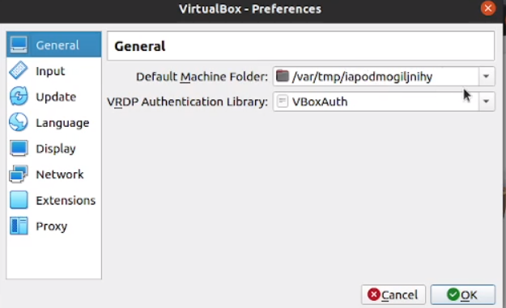{ #fig:001 width=70% }

Создал виртуальную машину под названием Base версии Red Had (64 bit)

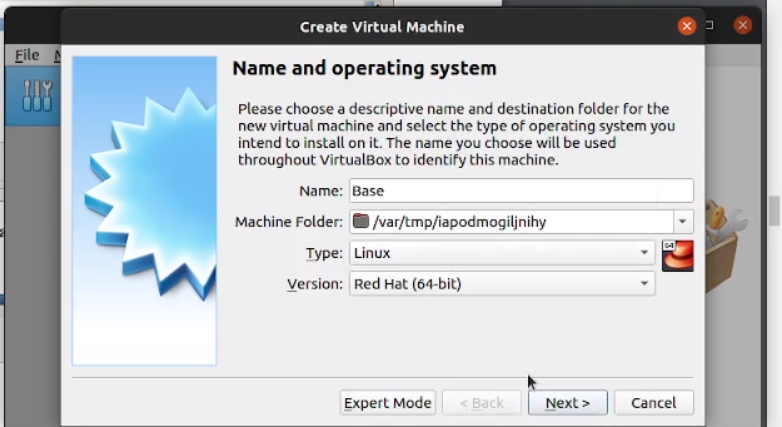{ #fig:002 width=70% }

Выбрал опцию виртуального жёсткого диска  

{ #fig:003 width=70% }

Выбрал опцию VDI

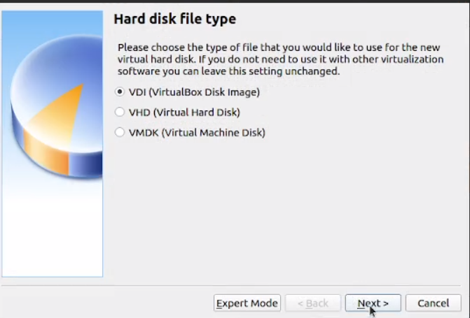{ #fig:004 width=70% }

Выбрал опцию динамичесского выделения памяти

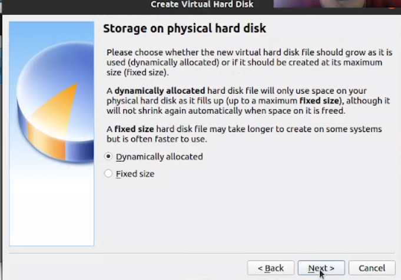{ #fig:005 width=70% }

Установил объем диска 40GB

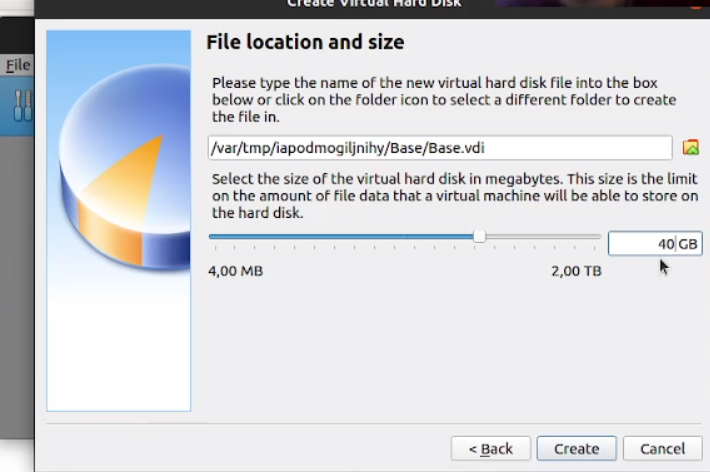{ #fig:006 width=70% }

Выбрал заранее скачанный оптический диск CentOS

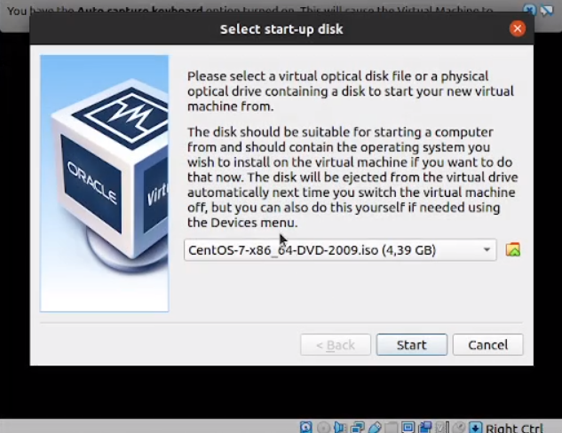{ #fig:007 width=70% }

Установил имя iapodmogiljnihy в виртуальной машине

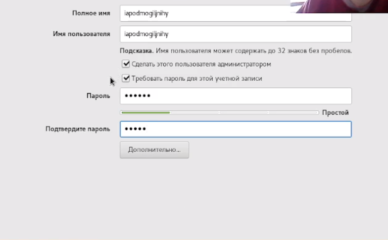{ #fig:008 width=70% }

Выбрал устройство установки виртуальной машины и перешел к установке

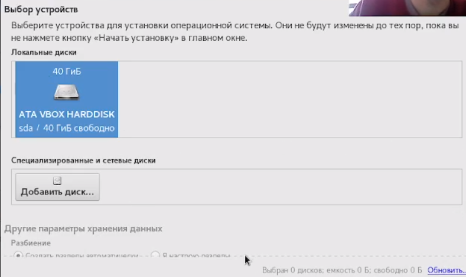{ #fig:009 width=70% }

После установки виртуальной машины перешёл к установке этой машины для множественного использования

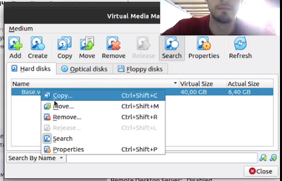{ #fig:010 width=70% }

Установил тип машины Multi-Attach

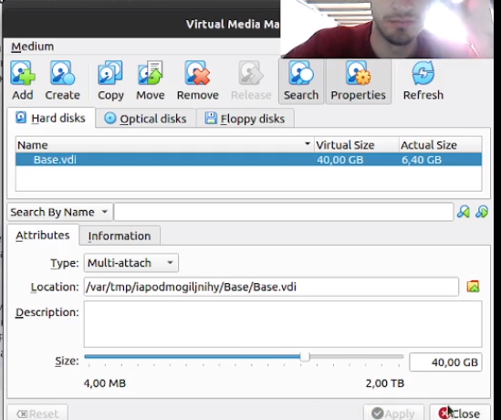{ #fig:011 width=70% }

Создал новую виртуальную машину под названием Host2, повторил ранее описанную процедуру

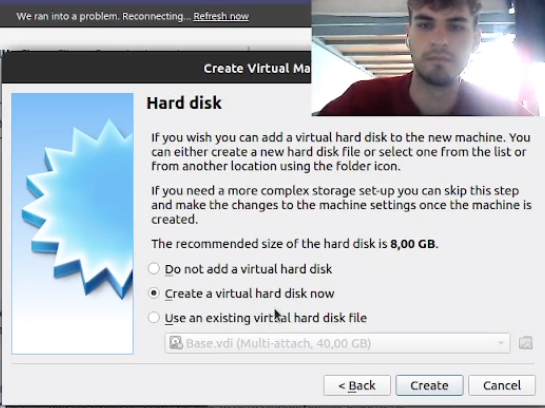{ #fig:012 width=70% }

Как видно на рисунке, запустилась ранее сконфигурированная виртуальная машина.

{ #fig:013 width=70% }

# Выводы

Приобрёл практические навыки установки операционной системы на виртуальную машину, настройки минимально необходимых для
дальнейшей работы сервисов.
