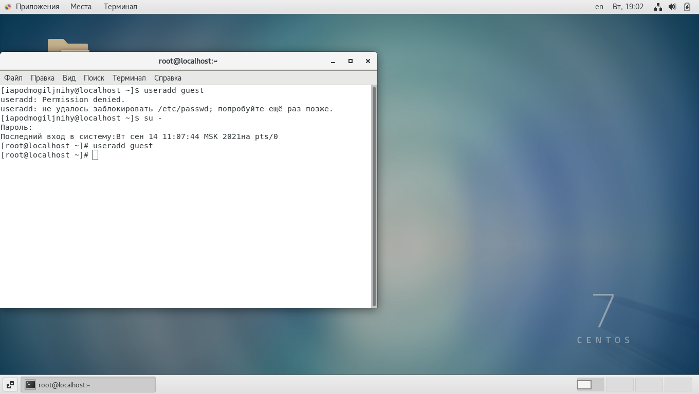
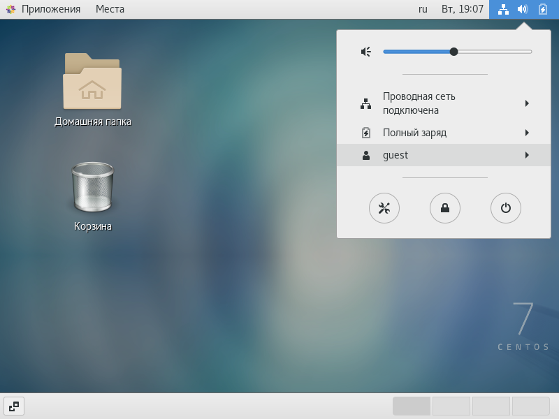

---
# Front matter
title: "Информационная безопасность."
subtitle: "Лабораторная работа №2."
author: "Подмогильный Иван Александрович."

# Generic otions
lang: ru-RU
toc-title: "Содержание"

# Bibliography

# Pdf output format
toc: true # Table of contents
toc_depth: 2
lof: true # List of figures
lot: true # List of tables
fontsize: 12pt
linestretch: 1.5
papersize: a4
documentclass: scrreprt
## I18n
polyglossia-lang:
  name: russian
  options:
  - spelling=modern
  - babelshorthands=true
polyglossia-otherlangs:
  name: english
### Fonts
mainfont: PT Serif
romanfont: PT Serif
sansfont: PT Sans
monofont: PT Mono
mainfontoptions: Ligatures=TeX
romanfontoptions: Ligatures=TeX
sansfontoptions: Ligatures=TeX,Scale=MatchLowercase
monofontoptions: Scale=MatchLowercase,Scale=0.9
## Biblatex
biblatex: true
biblio-style: "gost-numeric"
biblatexoptions:
  - parentracker=true
  - backend=biber
  - hyperref=auto
  - language=auto
  - autolang=other*
  - citestyle=gost-numeric
## Misc options
indent: true
header-includes:
  - \linepenalty=10 # the penalty added to the badness of each line within a paragraph (no associated penalty node) Increasing the value makes tex try to have fewer lines in the paragraph.
  - \interlinepenalty=0 # value of the penalty (node) added after each line of a paragraph.
  - \hyphenpenalty=50 # the penalty for line breaking at an automatically inserted hyphen
  - \exhyphenpenalty=50 # the penalty for line breaking at an explicit hyphen
  - \binoppenalty=700 # the penalty for breaking a line at a binary operator
  - \relpenalty=500 # the penalty for breaking a line at a relation
  - \clubpenalty=150 # extra penalty for breaking after first line of a paragraph
  - \widowpenalty=150 # extra penalty for breaking before last line of a paragraph
  - \displaywidowpenalty=50 # extra penalty for breaking before last line before a display math
  - \brokenpenalty=100 # extra penalty for page breaking after a hyphenated line
  - \predisplaypenalty=10000 # penalty for breaking before a display
  - \postdisplaypenalty=0 # penalty for breaking after a display
  - \floatingpenalty = 20000 # penalty for splitting an insertion (can only be split footnote in standard LaTeX)
  - \raggedbottom # or \flushbottom
  - \usepackage{float} # keep figures where there are in the text
  - \floatplacement{figure}{H} # keep figures where there are in the text
---

# Цель работы

Получение практических навыков работы в консоли с атрибутами файлов, закрепление теоретических основ дискреционного разграничения доступа в современных системах с открытым кодом на базе ОС Linux

# Задание

1) Выполнить пункты из по порядку выполнения работы
2) Заполнить таблицу с правами доступа размером 64 строк
3) Заполнить таблицу с минимальными правами для совершения операция

# Выполнение лабораторной работы

С помощью команды `useradd guest` создал учетную запись гостя.

{ #fig:001 width=70% }

Задал пароль для пользователя guest командой `passwd guest` и зашёл от имени пользователя guest.

{ #fig:002 width=70% }

Определил директорию комндой `pwd`. Получил директорию `/home/guest`: да, она является домшней директорией пользователя guest.

{ #fig:003 width=70% }

Уточнил имя пользователя командой `whoami`.

{ #fig:004 width=70% }

Уточнил имя пользователя, его группу, а также группы, куда входит пользователь, командой `id`. Также выполнил команду `groups`. Последняя команда даёт лишь название группы, в то время как предыдущая команда даёт более расширенную информацию, в том числе номер и название группы.

{ #fig:005 width=70% }

{ #fig:006 width=70% }

Имя пользователя guest было получено с помощью предыдущих команд, также имя пользователя указано в приглашении командной строки, до знака `@`

Просмотрел файл `/etc/passwd` командой `cat /etc/passwd`. Нашёл в нём свою учетную запись, определил uid пользователя (1001) и gid пользователя (1001), эти значения совпадают со значениями, полученными ранее.

{ #fig:007 width=70% }

{ #fig:008 width=70% }

Получил данные о пользователе с помощью команды `cat /etc/passwd | grep guest`

{ #fig:009 width=70% }

Определил существующие в системе директории командой `ls -l /home/`. Мне удалось получить список поддиректорий, в обоих директориях установлены все права только для владельца.

{ #fig:010 width=70% }

Проверил, какие расширенные атрибуты установлены на поддиректориях, находящихся в директории `/home`, командой: `lsattr /home`. Для пользователя iapodmogiljnihy я не получил результата, нет прав. Для пользователя guest был получен вывод.

{ #fig:011 width=70% }

Создал в домашней директории поддиректорию dir1 командой
`mkdir dir1`. Определил командой `ls -l` и `lsattr`, какие права доступа и расширенные атрибуты были выставлены на директорию `dir1`

{ #fig:012 width=70% }

Снял с директории dir1 все атрибуты командой `chmod 000 dir1`, и проверил её с помощью команды `ls -l`

{ #fig:013 width=70% }

Попытался создать в директории dir1 файл file1 командой `echo "test" > /home/guest/dir1/file1`. Чтобы создать файл в директории dir1 нужно иметь как минимум права чтения и исполнения команд (это было выяснено эмпирическим путём.). Командой `ls -l /home/guest/dir1` не удалось узнать, создался ли файл, потому что на папке установлены нулевые права.

{ #fig:014 width=70% }

Заполнил таблицу 2.1. Я последовательно изменял права rwx для администратора, а затем rwx для группы. В итоге получил 70 строк в таблице (но я не претендую на правильность интерпритации задания). Последние 2 пачки строк не заполнены, потому что они являются лишь повторением последней заполненной пачки строк (от 010 до 700)

|Пр дир                   |Пр ф|Созд ф|Уд ф|Зап в ф|Чт ф|Смена дир|Просм ф-в в дир|Переим ф|См атриб ф|
|-------------|----|------|----|-------|----|---------|---------------|--------|----------|
|000                      |000 |-     |-   |-      |-   |-        |-              |-       |-         |
|100                      |000 |-     |-   |-      |-   |+        |-              |-       |+         |
|300                      |000 |+     |+   |-      |-   |+        |-              |+       |+         |
|700                      |000 |+     |+   |-      |-   |+        |+              |+       |+         |
|010                      |000 |-     |-   |-      |-   |-        |-              |-       |-         |
|030                      |000 |-     |-   |-      |-   |-        |-              |-       |-         |
|070                      |000 |-     |-   |-      |-   |-        |-              |-       |-         |
|710                      |000 |+     |+   |-      |-   |+        |+              |+       |+         |
|730                      |000 |+     |+   |-      |-   |+        |+              |+       |+         |
|770                      |000 |+     |+   |-      |-   |+        |+              |+       |+         |
|000                      |100 |-     |-   |-      |-   |-        |-              |-       |-         |
|100                      |100 |-     |-   |-      |-   |+        |-              |-       |+         |
|300                      |100 |+     |+   |-      |-   |+        |-              |+       |+         |
|700                      |100 |+     |+   |-      |-   |+        |+              |+       |+         |
|010                      |100 |-     |-   |-      |-   |-        |-              |-       |-         |
|030                      |100 |-     |-   |-      |-   |-        |-              |-       |-         |
|070                      |100 |-     |-   |-      |-   |-        |-              |-       |-         |
|710                      |100 |+     |+   |-      |-   |+        |+              |+       |+         |
|730                      |100 |+     |+   |-      |-   |+        |+              |+       |+         |
|770                      |100 |+     |+   |-      |-   |+        |+              |+       |+         |
|000                      |300 |-     |-   |-      |-   |-        |-              |-       |-         |
|300                      |300 |+     |+   |+      |-   |+        |-              |+       |+         |
|100                      |300 |-     |-   |+      |-   |+        |-              |-       |+         |
|700                      |300 |+     |+   |+      |-   |+        |+              |+       |+         |
|010                      |300 |-     |-   |-      |-   |-        |-              |-       |-         |
|030                      |300 |-     |-   |-      |-   |-        |-              |-       |-         |
|070                      |300 |-     |-   |-      |-   |-        |-              |-       |-         |
|710                      |300 |+     |+   |+      |-   |+        |+              |+       |+         |
|730                      |300 |+     |+   |+      |-   |+        |+              |+       |+         |
|770                      |300 |+     |+   |+      |-   |+        |+              |+       |+         |
|000                      |700 |-     |-   |-      |-   |-        |-              |-       |-         |
|100                      |700 |-     |-   |+      |+   |+        |-              |-       |+         |
|300                      |700 |+     |+   |+      |+   |+        |-              |+       |+         |
|700                      |700 |+     |+   |+      |+   |+        |+              |+       |+         |
|010                      |700 |-     |-   |-      |-   |-        |-              |-       |-         |
|030                      |700 |-     |-   |-      |-   |-        |-              |-       |-         |
|070                      |700 |-     |-   |-      |-   |-        |-              |-       |-         |
|710                      |700 |+     |+   |+      |+   |+        |+              |+       |+         |
|730                      |700 |+     |+   |+      |+   |+        |+              |+       |+         |
|770                      |700 |+     |+   |+      |+   |+        |+              |+       |+         |
|000                      |710 |-     |-   |-      |-   |-        |-              |-       |-         |
|100                      |710 |-     |-   |+      |+   |+        |-              |-       |+         |
|300                      |710 |+     |+   |+      |+   |+        |-              |+       |+         |
|700                      |710 |+     |+   |+      |+   |+        |+              |+       |+         |
|010                      |710 |      |    |       |    |         |               |        |          |
|030                      |710 |      |    |       |    |         |               |        |          |
|070                      |710 |      |    |       |    |         |               |        |          |
|710                      |710 |      |    |       |    |         |               |        |          |
|730                      |710 |      |    |       |    |         |               |        |          |
|770                      |710 |      |    |       |    |         |               |        |          |
|000                      |730 |      |    |       |    |         |               |        |          |
|100                      |730 |      |    |       |    |         |               |        |          |
|300                      |730 |      |    |       |    |         |               |        |          |
|700                      |730 |      |    |       |    |         |               |        |          |
|010                      |730 |      |    |       |    |         |               |        |          |
|030                      |730 |      |    |       |    |         |               |        |          |
|070                      |730 |      |    |       |    |         |               |        |          |
|710                      |730 |      |    |       |    |         |               |        |          |
|730                      |730 |      |    |       |    |         |               |        |          |
|770                      |730 |      |    |       |    |         |               |        |          |
|000                      |770 |-     |-   |-      |-   |-        |-              |-       |-         |
|100                      |770 |      |    |       |    |         |               |        |          |
|300                      |770 |      |    |       |    |         |               |        |          |
|700                      |770 |      |    |       |    |         |               |        |          |
|010                      |770 |      |    |       |    |         |               |        |          |
|030                      |770 |      |    |       |    |         |               |        |          |
|070                      |770 |      |    |       |    |         |               |        |          |
|710                      |770 |      |    |       |    |         |               |        |          |
|730                      |770 |      |    |       |    |         |               |        |          |
|770                      |770 |      |    |       |    |         |               |        |          |

Заполнил таблицу 2.2 с минимальными правами для совершения операция.

## Таблица 2.2

|Операция                 |Мин пр на дир|Мин пр на ф|
|-------------------------|-------------------------|-------------------|
|Создание файла           |wx                       |rw (default when crating the file)|
|Удаление файла           |wx                             |w                        |
|Чтение файла             |x                              |r                        |
|Запись в файл            |x                              |w                        |
|Переименование файла     |wx                       |- - -                    |
|Создание поддиректории   |wx                       |- - -                    |
|Удаление поддиректории   |wx                       |- - -                    |

# Выводы

Получил практические навыки работы в консоли с атрибутами файлов, закрепил теоретические основы дискреционного разграничения доступа в современных системах с открытым кодом на базе ОС Linux.

Замечание: Вероятно, таблица, которую я составил, неверна. Я принял, что можно менять значения и администратора и группы. Тогда имеем 64 варианта для файла и 64 варианта для группы, итого 512 вариантов, что, конечно же, не является ожидаемым результатом.  
Нужно было менять значения только для администратора. Тогда имеем 8 вариантов для папки, и для файла. Учитывая, что мы должны рассмотреть все варианты, имеем 64 варианта, как и указано в задании.
