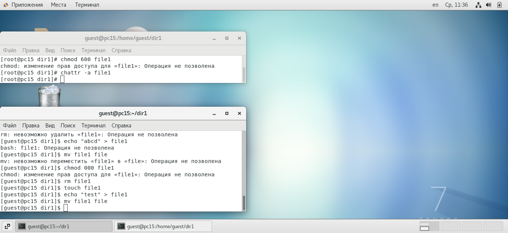

---
## Front matter
lang: ru-RU
title: Лабораторная работа №4
author: |
	Подмогильный Иван Александрович - студент группы НКНбд-01-18
date: 28.10.2021

## Formatting
toc: false
slide_level: 2
theme: metropolis
header-includes:
 - \metroset{progressbar=frametitle,sectionpage=progressbar,numbering=fraction}
 - '\makeatletter'
 - '\beamer@ignorenonframefalse'
 - '\makeatother'
aspectratio: 43
section-titles: true
---

# Дискреционное разграничение прав в Linux. Расширенные атрибуты.

## Прагматика выполнения

- Умение пользоваться командами установления расширенных атрибутов.

## Цель выполнения лабораторной работы

Научиться пользоваться командами установления расширенных атрибутов.

## Задачи выполнения работы

- Выполнение пунктов по исполнению команд.

## Результаты выполнения лабораторной работы. Часть 1

Изменил расширенные атрибуты файла командой `chattr +a /home/guest/dir1/file1`
Попробовал удалить, переименовать, перезаписать контент file1, а также дозаписать
в файл информацию. Все операции были не позволены, кроме дозаписи.

{ #fig:001 width=70% }

## Часть 2
Сделал все вышеперечисленные операции, при убранном расширенном атрибуте с помощью
команды `chattr -a /home/guest/dir1/file1`

{ #fig:002 width=70% }

## Часть 3

Добавил расширенный атрибут к файлу командой `chattr +i /home/guest/dir1/file1`
Ни одна из вышеперечисленных операций не была позволена, в том числе и дозапись
(`echo "hello" >> file1`)

{ #fig:003 width=70% }

## Выводы

Получил практические навыки работы в консоли с расширенными атрибутами файлов
