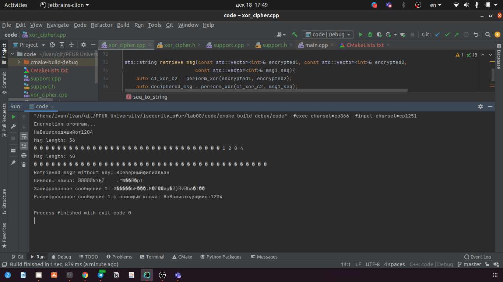
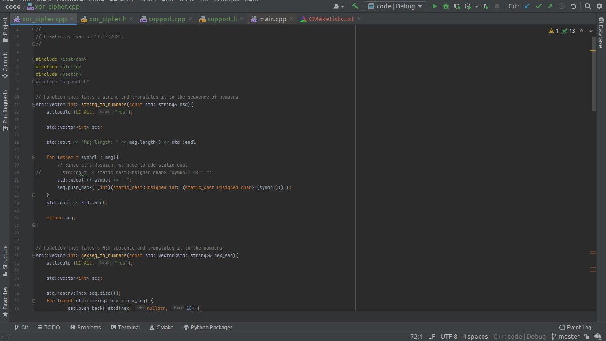
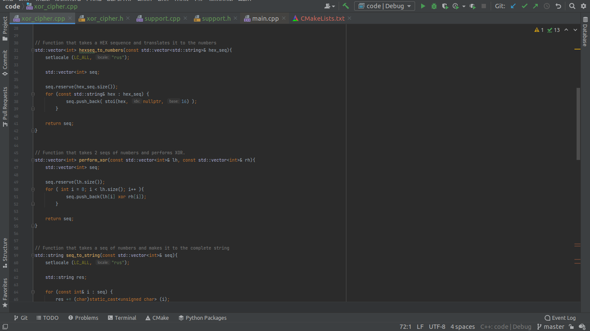
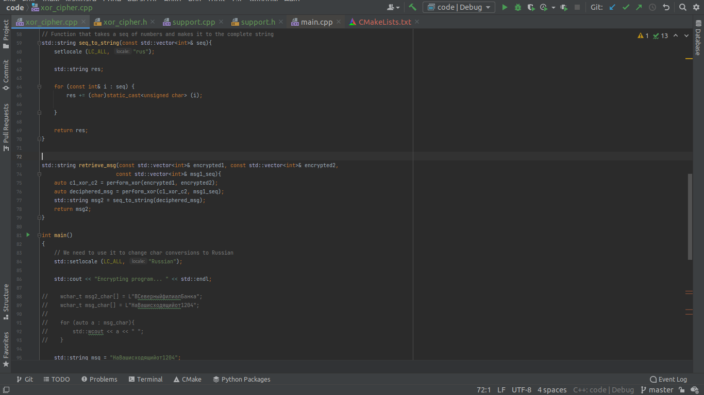
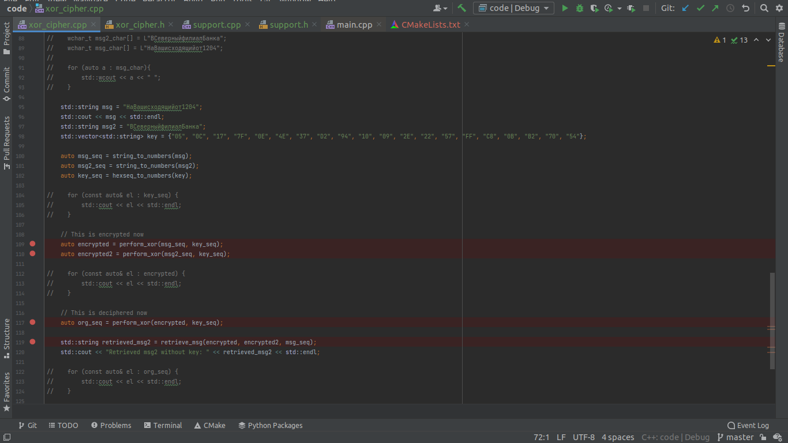
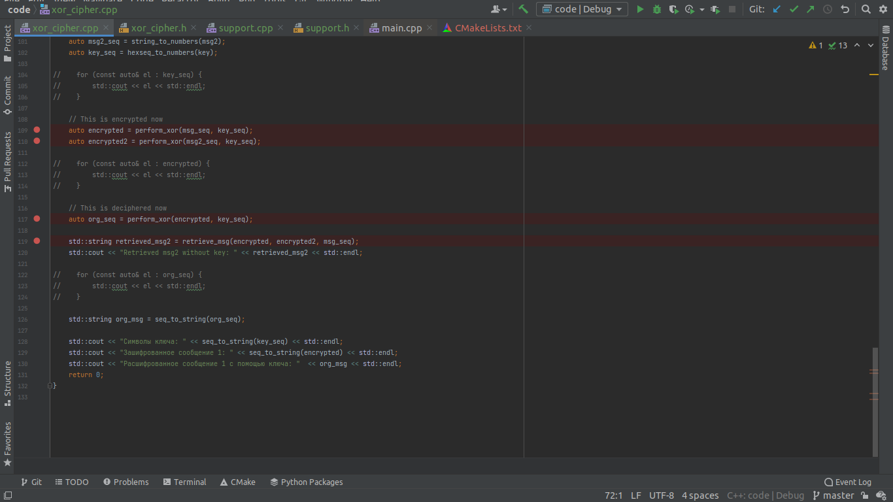

---
## Front matter
lang: ru-RU
title: Лабораторная работа №8
author: |
	Подмогильный Иван Александрович - студент группы НКНбд-01-18
date: 08.12.2021

## Formatting
toc: false
slide_level: 2
theme: metropolis
header-includes:
 - \metroset{progressbar=frametitle,sectionpage=progressbar,numbering=fraction}
 - '\makeatletter'
 - '\beamer@ignorenonframefalse'
 - '\makeatother'
aspectratio: 43
section-titles: true
---

# Элементы криптографии. Однократное гаммирование

## Прагматика выполнения

Элементы криптографии. Шифрование (кодирование)
различных исходных текстов одним ключом

## Цель выполнения лабораторной работы

Освоить на практике применение режима однократного гаммирования
на примере кодирования различных исходных текстов одним ключом

## Задачи выполнения работы

Написать приложение, которое кодирует и декодирует сообщения с помощью xor-шифра. А также то, которое может декодировать второе сообщение, имея два зашифрованных сообщения и одно оригинальное сообщение.

## Результаты выполнения лабораторной работы. Часть 1

Написал код, шифрующий и дешифрующий сообщение. Вывод.

{ #fig:001 width=70% }

## Код. Часть 2.

{ #fig:002 width=70% }

## Код. Часть 3.

{ #fig:003 width=70% }

## Код. Часть 4:

{ #fig:004 width=70% }

## Код. Часть 5:

{ #fig:005 width=70% }

## Код. Часть 6:

{ #fig:006 width=70% }

## Выводы

Освоил на практике применение режима однократного гаммирования
на примере кодирования различных исходных текстов одним ключом
